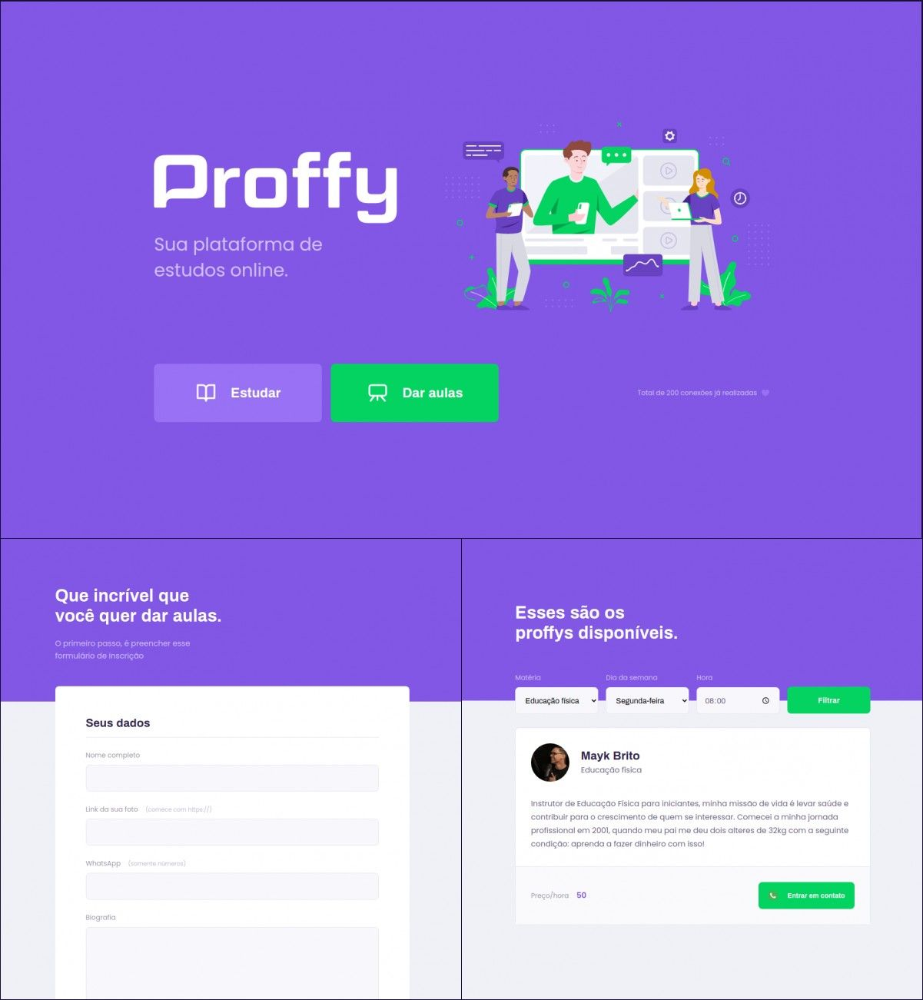

<h1 align="center">
    
    <br>Next Level Week #2<br/>
    Node.js | ReactJS | React Native
</h1>

<p align="center">
  
  <br/>
  <br/>
</p>

<p align="center">
  <a href="#bookmark-sobre">Sobre</a>&nbsp;&nbsp;&nbsp;|&nbsp;&nbsp;&nbsp;
  <a href="#rocket-tecnologias">Tecnologias</a>&nbsp;&nbsp;&nbsp;|&nbsp;&nbsp;&nbsp;
  <a href="#arrow_forward-como-executar">Como Executar</a>&nbsp;&nbsp;&nbsp;|&nbsp;&nbsp;&nbsp;
</p>

<p align="center">
  
<p>

## :bookmark: Sobre

O **Proffy** é uma aplicação Web e Mobile feita para auxiliar na conexão entre os alunos e os professores. Logo, esta aplicação oferece aos professores a possibilidade de registrar aulas, podendo adicionar informações como a disciplina, o custo e horário.

Este projeto foi criado pensando no **6 de agosto**, o **Dia Nacional dos Profissionais da Educação**.

Essa aplicação foi realizada durante a Next **Level Week #2**, onde foi desenvolvido com o conceito Mobile First e foi criado tambem a aplicação completa(backend, frontend e API)

## :rocket: Tecnologias

-  [Typescript](https://www.typescriptlang.org/)
-  [Node.js](https://nodejs.org/en/)
-  [ReactJS](https://reactjs.org/)
-  [React Native](http://facebook.github.io/react-native/)
-  [Expo](https://expo.io/)
-  [Express](https://expressjs.com/)
-  [axios](https://github.com/axios/axios)


<div align="center">

# :globe_with_meridians: _**Server**_

</div>

O servidor da aplicação foi desenvolvido seguindo a metodologia _API Rest_ para poder ser tanto na web quando no aplicativo mobile.

Foi usada as tecnologias [**NodeJS**](https://nodejs.org/) com [**Typescript**](https://www.typescriptlang.org/), banco de dados [**SQLite3**](https://sqlite.org/) com query builder [**Knex**](http://knexjs.org/).


## :arrow_forward: Como executar

_com **npm**_

```bash
# Instalar dependências
$ npm install
# Criar database
$ npm knex:migrate
# Iniciar servidor
$ npm start
```

_com **yarn**_

```bash
# Instalar dependências
$ yarn
# Criar banco de dados
$ yarn knex:migrate
# Iniciar servidor de desenvolvimento
$ yarn start
```

---
